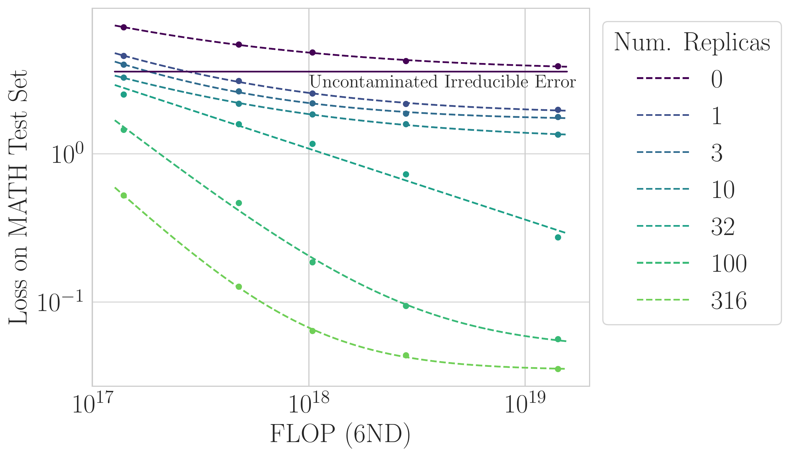
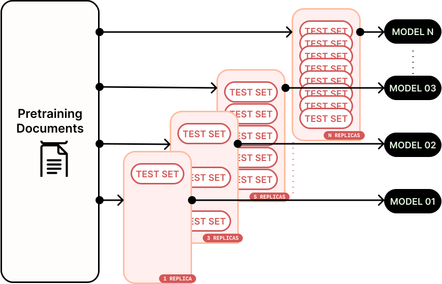

# Quantifying the Effect of Test Set Contamination on Generative Evaluations

[](https://arxiv.org/abs/2601.04301)

> **A single copy of the test set can beat "infinite" pretraining compute — but this competence is fragile and collapses under stochastic sampling.**

<p align="center">
  
</p>

We systematically study how test set contamination affects generative evaluations by pretraining Qwen3 models (34M–344M parameters) with controlled amounts of MATH benchmark contamination. Key findings:

- **Contamination breaks scaling laws** — A single test set replica achieves lower loss than uncontaminated models with "infinite" compute
- **Greedy decoding masks the problem** — At temperature 0, contaminated models appear highly capable
- **Stochastic sampling reveals fragility** — Increasing temperature causes up to 40× accuracy collapse in contaminated models

<p align="center">
  <a href="#setup">Setup</a> •
  <a href="#reproducing-results">Reproducing Results</a> •
  <a href="#repository-structure">Repository Structure</a> •
  <a href="#citation">Citation</a>
</p>

---

## Setup

```bash
# Install uv package manager
conda install conda-forge::uv

# Create and activate environment
uv venv -p 3.11.5 gen_contam_env
source gen_contam_env/bin/activate

# Install dependencies
uv pip install -r requirements.txt

# Install EleutherAI LM Evaluation Harness
git clone --depth 1 https://github.com/EleutherAI/lm-evaluation-harness
cd lm-evaluation-harness
uv pip install -e .[math]
uv pip install flash-attn==2.7.2.post1 --no-build-isolation
```

## Reproducing Results

<p align="center">
  
</p>

**Pretraining with controlled contamination:**

```bash
# Single GPU
python scripts/pretrain_language_model.py

# Multi-GPU
torchrun --standalone --nproc_per_node=4 scripts/pretrain_language_model.py
```

Key parameters in `src/globals.py`:
- `num_benchmark_replicas_per_epoch` — Test set copies (0, 1, 3, 10, 32, 100, 316, 1000, 3162)
- `benchmark_subset_fraction` — Fraction of benchmark to contaminate

**Running W&B sweeps:**

```bash
wandb sweep sweeps/pt/math_82gb_1xOT/model=qwen3-34M-1xOT.yaml
wandb agent <agent-id>
```

**Evaluation:**

```bash
python scripts/eval_language_model.py
```

## Repository Structure

```
src/           Core modules (data loading, models, scaling laws)
scripts/       Training and evaluation scripts
notebooks/     Analysis notebooks for paper figures
sweeps/        W&B sweep configurations
manuscript/    Paper source and figures
```

## Citation

```bibtex
@article{schaeffer2025contamination,
  title={Quantifying the Effect of Test Set Contamination on Generative Evaluations},
  author={Schaeffer, Rylan and Kazdan, Joshua and Abbasi, Baber and Liu, Ken Ziyu and
          Miranda, Brando and Ahmed, Ahmed and Barez, Fazl and Puri, Abhay and
          Biderman, Stella and Mireshghallah, Niloofar and Koyejo, Sanmi},
  journal={arXiv preprint arXiv:2601.04301},
  year={2025}
}
```

## Contact

Questions or interested in collaborating? Open an issue or email [rschaef@cs.stanford.edu](mailto:rschaef@cs.stanford.edu) or [sanmi@cs.stanford.edu](mailto:sanmi@cs.stanford.edu).
