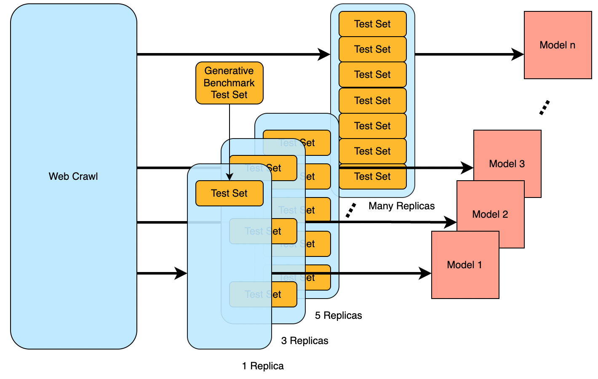

# Quantifying the Effect of Test Set Contamination on Generative Evaluations

**Can a single test set replica beat infinite compute? Yes—but it's fragile.**

This repository contains the code for our ICML 2026 paper investigating how test set contamination affects generative benchmarks. While prior work focused on discriminative evaluations (multiple-choice), we reveal that contamination in generative settings relies on **fragile verbatim memorization** that behaves fundamentally differently from robust reasoning.

<p align="center">
  
</p>

**Authors:** [Rylan Schaeffer](mailto:rschaef@cs.stanford.edu)\*, [Joshua Kazdan](mailto:jkazdan@stanford.edu)\*, Baber Abbasi, Ken Ziyu Liu, Brando Miranda, Ahmed Ahmed, Fazl Barez, Abhay Puri, Niloofar Mireshghallah, [Sanmi Koyejo](mailto:sanmi@cs.stanford.edu)

\*Equal contribution

---

## Key Findings

### 1. A Single Test Set Replica Beats "Infinite" Compute

Using neural scaling laws, we discover that including **even one replica** of the MATH test set in pretraining enables models to achieve lower loss than the irreducible error of training on uncontaminated data—effectively buying more than infinite compute.

<p align="center">
  
</p>

### 2. But This "Competence" Is Brittle

Unlike robust reasoning, memorization-driven performance **collapses under stochastic sampling**:
- Increasing temperature from 0→1 reduces highly contaminated model performance by **40x**
- Longer solutions show **exponential decay** in accuracy (vs power-law for genuine reasoning)

<p align="center">
  
</p>

### 3. SFT Can Both Help and Hurt

Supervised fine-tuning on the training set has **opposing effects** depending on contamination level:
- **Low contamination:** SFT improves test performance (generalization wins)
- **High contamination:** SFT *decreases* test performance (forgetting memorized data)

### 4. Overtraining Dilutes the "Dose"

Training beyond compute-optimal with fresh data reduces contamination effects—the additional tokens dilute the contaminated data's influence.

### 5. Bug Fix for EleutherAI's Math Verify

We identified and fixed a critical bug in the widely-used LM Evaluation Harness that caused gold reference solutions to score only ~70% instead of 100%.

---

## Repository Structure

```
├── src/                    # Core modules
│   ├── globals.py          # Default configs (contamination params here)
│   ├── models.py           # Qwen3 model creation/loading
│   ├── data.py             # Dataset creation with controlled contamination
│   ├── analyze.py          # W&B metrics extraction
│   ├── plot.py             # Visualization utilities
│   └── neural_scaling_laws.py  # Scaling law fitting (L = E + C₀·C^(-α))
│
├── scripts/                # Training & evaluation
│   ├── pretrain_language_model.py   # Pretraining with contaminated corpora
│   ├── sft_language_model.py        # Supervised fine-tuning
│   └── eval_language_model.py       # vLLM-based evaluation
│
├── notebooks/              # Analysis & figure generation
│   ├── 10_*/11_*/          # Pretraining results (cross-entropy & math verify)
│   ├── 12_*/13_*/          # SFT results
│   ├── 20_*/               # Contamination vs compute scaling
│   └── 30_*/               # Dose-response curves
│
├── sweeps/                 # W&B sweep configs
│   ├── pt/                 # Pretraining (model sizes × contamination levels)
│   ├── sft/                # Supervised fine-tuning
│   └── eval_*/             # Evaluation sweeps
│
└── manuscript/             # ICML 2026 paper source
```

---

## Reproducing Our Results

### Setup

```bash
# Install uv package manager
conda install conda-forge::uv

# Create and activate environment
uv venv -p 3.11.5 mem_scoring_vs_sampling_env
source mem_scoring_vs_sampling_env/bin/activate

# Install dependencies
uv pip install -r requirements.txt

# Install EleutherAI LM Evaluation Harness (with our bug fix)
git clone --depth 1 https://github.com/EleutherAI/lm-evaluation-harness
cd lm-evaluation-harness
uv pip install -e .[math]
uv pip install flash-attn==2.7.2.post1 --no-build-isolation
```

### Pretraining with Controlled Contamination

The key contamination parameters in `src/globals.py`:
- `num_benchmark_replicas_per_epoch`: Number of test set copies (0, 1, 3, 10, 32, 100, 316, 1000, 3162)
- `benchmark_subset_fraction`: Fraction of benchmark to include

```bash
# Single GPU
python scripts/pretrain_language_model.py

# Multi-GPU
torchrun --standalone --nproc_per_node=4 scripts/pretrain_language_model.py
```

Models are named: `mem_[model]_[benchmark]_rep_[replicas]_sbst_[subset]_epch_[epochs]_ot_[overtrain]`

### Running Sweeps

```bash
# Example: Grid search over contamination levels for 34M model
wandb sweep sweeps/pt/math_82gb_1xOT/model=qwen3-34M-1xOT.yaml
wandb agent <agent-id>
```

### Evaluation

```bash
python scripts/eval_language_model.py
```

Uses vLLM for efficient inference with temperature sweeps (0, 0.1, 0.18, ..., 1.5).

---

## How the Code Maps to Paper Sections

| Paper Section | Code Location |
|---------------|---------------|
| §2 Methodology | `src/data.py` (contaminated dataset creation), `src/models.py` (Qwen3 setup) |
| §3 Pretraining Results | `notebooks/10_*`, `notebooks/11_*`, `notebooks/20_*` |
| §4 Further Training (SFT) | `scripts/sft_language_model.py`, `notebooks/12_*`, `notebooks/13_*` |
| §5 Temperature & Length | `scripts/eval_language_model.py`, `notebooks/11_*` (temperature sweeps) |
| Scaling Law Fitting | `src/neural_scaling_laws.py` (`PowerLawScalingFitter`) |
| Figure 1 | `notebooks/11_math_qwen3_pt_math_verify/` |
| Figure 2 (Scaling Laws) | `notebooks/20_gen_eval_contamination_vs_compute/` |

---

## Citation

```bibtex
@inproceedings{schaeffer2026contamination,
  title={Quantifying the Effect of Test Set Contamination on Generative Evaluations},
  author={Schaeffer, Rylan and Kazdan, Joshua and Abbasi, Baber and Liu, Ken Ziyu and Miranda, Brando and Ahmed, Ahmed and Barez, Fazl and Puri, Abhay and Mireshghallah, Niloofar and Koyejo, Sanmi},
  booktitle={International Conference on Machine Learning (ICML)},
  year={2026}
}
```

---

## Contributing

Please format using [black](https://github.com/psf/black): `black .`

## Contact

Questions? Comments? Interested in collaborating? Open an issue or email [rschaef@cs.stanford.edu](mailto:rschaef@cs.stanford.edu) and [sanmi@cs.stanford.edu](mailto:sanmi@cs.stanford.edu).
