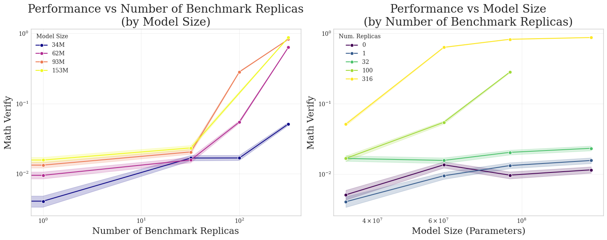

# Quantifying the Effect of Test Set Contamination on Generative Evaluations

[]()
[]()

This repository contains code and figures for our ICML 2026 paper [Quantifying the Effect of Test Set Contamination on Generative Evaluations](manuscript/Koyejo_Lab_Test_Set_Contamination_of_Generative_Benchmarks_ICML_2026_Manuscript.pdf).

**TL;DR:** A single test set replica can beat "infinite" compute—but this competence is fragile and collapses under stochastic sampling.

[**Setup**](#setup) | [**Reproducing Results**](#reproducing-results) | [**Repository Structure**](#repository-structure) | [**Citation**](#citation) | [**Contact**](#contact)

---

## Overview

We systematically study how test set contamination affects generative (open-ended) evaluations by pretraining Qwen3 models (34M–344M parameters) on FineWeb-Edu with controlled amounts of MATH benchmark contamination.

<p align="center">
  
</p>

### Key Findings

1. **Contamination breaks scaling laws:** A single test set replica achieves lower loss than uncontaminated models with "infinite" compute
2. **Greedy decoding masks the problem:** At temperature T=0, contaminated models appear highly capable
3. **Stochastic sampling reveals fragility:** Increasing temperature from 0→1 causes up to 40× performance collapse in heavily contaminated models
4. **Solution length matters:** Performance on contaminated problems decays exponentially with solution length
5. **SFT has dual effects:** Supervised fine-tuning helps uncontaminated models but hurts highly contaminated ones



---

## Setup

```bash
# Install uv package manager
conda install conda-forge::uv

# Create and activate environment
uv venv -p 3.11.5 gen_contam_env
source gen_contam_env/bin/activate

# Install dependencies
uv pip install -r requirements.txt

# Install EleutherAI LM Evaluation Harness
git clone --depth 1 https://github.com/EleutherAI/lm-evaluation-harness
cd lm-evaluation-harness
uv pip install -e .[math]
uv pip install flash-attn==2.7.2.post1 --no-build-isolation
```

---

## Reproducing Results

### Pretraining with Controlled Contamination

Key contamination parameters in `src/globals.py`:
- `num_benchmark_replicas_per_epoch`: Test set copies (0, 1, 3, 10, 32, 100, 316, 1000, 3162)
- `benchmark_subset_fraction`: Fraction of benchmark to include

```bash
# Single GPU
python scripts/pretrain_language_model.py

# Multi-GPU
torchrun --standalone --nproc_per_node=4 scripts/pretrain_language_model.py
```

### Running Sweeps

```bash
wandb sweep sweeps/pt/math_82gb_1xOT/model=qwen3-34M-1xOT.yaml
wandb agent <agent-id>
```

### Evaluation

```bash
python scripts/eval_language_model.py
```

---

## Repository Structure

| Directory | Description |
|-----------|-------------|
| `src/` | Core modules: data loading, model creation, scaling law fitting |
| `scripts/` | Training (`pretrain_language_model.py`, `sft_language_model.py`) and evaluation |
| `notebooks/` | Analysis notebooks generating paper figures |
| `sweeps/` | W&B sweep configs for hyperparameter grids |
| `manuscript/` | ICML 2026 paper LaTeX source and figures |

---

## Citation

```bibtex
@inproceedings{schaeffer2026contamination,
  title={Quantifying the Effect of Test Set Contamination on Generative Evaluations},
  author={Schaeffer, Rylan and Kazdan, Joshua and Abbasi, Baber and Liu, Ken Ziyu and Miranda, Brando and Ahmed, Ahmed and Barez, Fazl and Puri, Abhay and Mireshghallah, Niloofar and Koyejo, Sanmi},
  booktitle={International Conference on Machine Learning (ICML)},
  year={2026}
}
```

---

## Contributing

Please format using [black](https://github.com/psf/black): `black .`

---

## Contact

Questions? Comments? Interested in collaborating? Open an issue or email [rschaef@cs.stanford.edu](mailto:rschaef@cs.stanford.edu) and [sanmi@cs.stanford.edu](mailto:sanmi@cs.stanford.edu).
