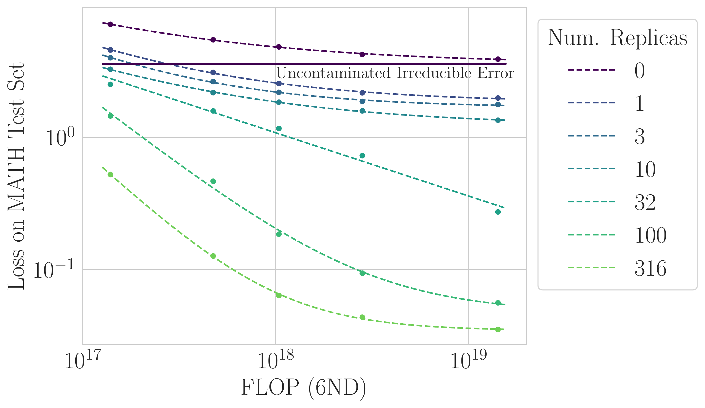
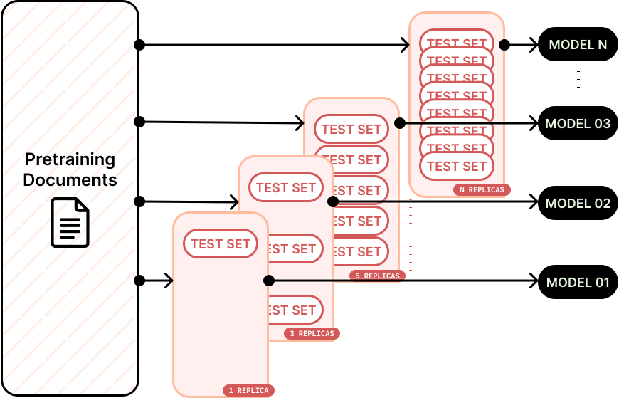

# Test Set Contamination of Generative Evaluations

[](https://arxiv.org/abs/2601.04301)

> **A single copy of the test set can beat "infinite" pretraining compute — but this competence is fragile and collapses under stochastic sampling.**

<p align="center">
  
</p>

We systematically study how test set contamination affects generative evaluations by pretraining Qwen3
models (34M–344M parameters) with controlled amounts of MATH benchmark contamination. Key findings:

- **Contamination breaks scaling laws** — A single test set replica achieves lower loss than uncontaminated models with "infinite" compute
- **Greedy decoding masks the problem** — At temperature 0, contaminated models appear highly capable
- **Stochastic sampling reveals fragility** — Increasing temperature causes up to 40× accuracy collapse in contaminated models

<p align="center">
  <a href="#setup">Setup</a> •
  <a href="#where-things-live">Where Things Live</a> •
  <a href="#reproducing-results">Reproducing Results</a> •
  <a href="#repository-structure">Repository Structure</a> •
  <a href="#citation">Citation</a>
</p>

> **Working on this repo?** Start with [`docs/EXPERIMENT_INVENTORY.md`](docs/EXPERIMENT_INVENTORY.md)
> (what has actually been trained and evaluated) and [`docs/INFRASTRUCTURE.md`](docs/INFRASTRUCTURE.md)
> (which cluster node, which environment, which W&B project). Those two files answer most
> "does X already exist?" questions without a cluster login.

---

## Setup

```bash
# Install uv package manager
conda install conda-forge::uv

# Create and activate environment
uv venv -p 3.11.5 mem_scoring_vs_sampling_env
source mem_scoring_vs_sampling_env/bin/activate

# Install dependencies
uv pip install -r requirements.txt

# Install EleutherAI LM Evaluation Harness (required for math-verify)
git clone --depth 1 https://github.com/EleutherAI/lm-evaluation-harness
cd lm-evaluation-harness
uv pip install -e .[math]
uv pip install flash-attn==2.7.2.post1 --no-build-isolation
```

Environment variables required: `WANDB_API_KEY`, `HF_TOKEN`.

> The environment is named `mem_scoring_vs_sampling_env` — this matches what every logged
> experiment actually ran under. (Earlier versions of this README said `gen_contam_env`; no
> such environment exists on the cluster.) See [`docs/INFRASTRUCTURE.md`](docs/INFRASTRUCTURE.md).

## Where Things Live

| Question | Answer |
|---|---|
| Which cluster node? | Training/eval for this paper ran on **`skampere1`** (8× A100-80GB). See [`docs/INFRASTRUCTURE.md`](docs/INFRASTRUCTURE.md). |
| What models exist? | ~470 checkpoints on the HF Hub under [`RylanSchaeffer/mem_Qwen3-*`](https://huggingface.co/RylanSchaeffer). Full grid in [`docs/EXPERIMENT_INVENTORY.md`](docs/EXPERIMENT_INVENTORY.md). |
| What's already been evaluated? | [`docs/EXPERIMENT_INVENTORY.md`](docs/EXPERIMENT_INVENTORY.md) — including what is **not** evaluated, which is usually the question you're actually asking. |
| Which W&B project? | Five distinct projects; the mapping is non-obvious. See [`docs/INFRASTRUCTURE.md`](docs/INFRASTRUCTURE.md#weights--biases-projects). |
| Which notebook makes which figure? | [Notebook → figure map](#notebook--figure-map) below. |
| What's the current paper status? | NeurIPS 2026 submission 32216 under review; see [`reviews/`](reviews/). |

**Model naming convention** (this is the primary key for everything):

```
mem_Qwen3-{size}_{benchmark}_rep_{R}_sbst_{F}_epch_{E}_ot_{M}[_sft]
                                    │         │        │      │    └─ present iff SFT'd
                                    │         │        │      └────── overtrain multiplier ∈ {1,2,4,8,16}
                                    │         │        └───────────── pretraining epochs
                                    │         └────────────────────── benchmark_subset_fraction
                                    └──────────────────────────────── test set replicas per epoch
```

## Reproducing Results

<p align="center">
  
</p>

**Pretraining with controlled contamination:**

```bash
# Single GPU
python scripts/pretrain_language_model.py

# Multi-GPU
torchrun --standalone --nproc_per_node=4 scripts/pretrain_language_model.py
```

Key parameters in `src/globals.py`:
- `num_benchmark_replicas_per_epoch` — Test set copies (0, 1, 3, 10, 32, 100, 316, 1000, 3162)
- `benchmark_subset_fraction` — Fraction of benchmark to contaminate

**Running W&B sweeps:**

```bash
wandb sweep sweeps/pt/math_82gb_1xOT/model=qwen3-34M-1xOT.yaml
wandb agent <agent-id>
```

**Evaluation:**

```bash
# Generative eval: vLLM sampling + math-verify scoring (4-shot, boxed-answer required)
python scripts/eval_language_model.py

# Teacher-forced eval: log probs of ground-truth solutions, no sampling
python scripts/eval_language_model_teacher_forcing.py
```

A single generative eval run takes **3–6 minutes** (median, measured over 401 finished runs);
vLLM startup dominates for these model sizes.

## Repository Structure

```
src/                        Core modules
  globals.py                  Default configs + MODEL_NAMES_TO_PARAMETERS_DICT
  data.py                     Contamination injection; benchmark loaders
  models.py                   Qwen3 creation (from scratch) and loading
  analyze.py                  W&B → pandas helpers (with on-disk caching)
  plot.py                     Publication plotting conventions (see CLAUDE.md)
  neural_scaling_laws.py      PowerLawScalingFitter: L(C,R) = E(R) + C_0(R)·C^(-α(R))
  scoring.py                  Corrected math-verify scoring
scripts/                    Training and evaluation entry points
notebooks/                  Analysis; each dir is {code}.py + data/ + results/
sweeps/                     W&B sweep configs (pt/, sft/, eval_pt/, eval_sft/, ...)
manuscript_neurips_2026/    Current submission (NeurIPS 2026, #32216)
manuscript_icml_2026/       Prior submission (rejected)
manuscript_fdgm_icml_2026/  ICML 2026 FoGen workshop version (accepted, poster)
reviews/                    Reviews, rebuttals, and response plans per venue
docs/                       Infrastructure and experiment inventory
tests/                      Unit tests
```

Notebooks follow a strict convention: `notebooks/NN_name/NN_name.py` writes cached W&B pulls to
`notebooks/NN_name/data/` and figures to `notebooks/NN_name/results/`. Figures are copied into
`manuscript_*/figures/NN_name/` for inclusion.

### Notebook → figure map

| Notebook | Produces | Used in NeurIPS manuscript? |
|---|---|---|
| `10_math_qwen3_pt_cross_entropy` | Pretraining loss vs. replicas / compute / overtraining | Yes (4 figures) |
| `11_math_qwen3_pt_math_verify` | Math Verify vs. replicas, temperature, solution length | Yes (4 figures) |
| `12_math_qwen3_sft_cross_entropy` | SFT loss before/after | Yes (1 figure) |
| `13_math_qwen3_sft_math_verify` | **Math Verify after SFT** | **No — data exists, never folded in** |
| `14_..._teacher_forcing` | Per-token NLL, cumulative probability, survival fits | Yes (3 figures) |
| `15_..._rephrase_perturbations` | Rephrased/perturbed Math Verify | Numbers only (Table 1) |
| `16_sft_generalization_teacher_forcing_perturbed` | SFT generalization to perturbed MATH | **No — cited as prose only** |
| `20_gen_eval_contamination_vs_compute` | Scaling law fits, irreducible error | Yes (2 figures) |
| `30_..._dose_response` | Dose-response curves | No |
| `40_gadre_2024_validation` | Scaling-law validation against Gadre et al. | No |
| `50_phase_diagram` | Three-regime phase diagram | Yes (1 figure) |

## Known Issues

Verified as of 2026-07-27. See [`reviews/2026_neurips/NEXT_STEPS.md`](reviews/2026_neurips/NEXT_STEPS.md).

- **Author list mismatch.** The OpenReview submission lists 12 authors; `manuscript_neurips_2026/00_main.tex`
  lists 11 — **Yegor Denisov-Blanch is missing from the LaTeX author block** and from the citation below.
- **`memorization-scoring-vs-sampling-pt` does not exist on W&B.** It is referenced 16 times across
  `notebooks/10_*` and the `sweeps/pt/` YAMLs, but the W&B API reports no such project under entity
  `rylan`. Pretraining runs that survive are under `memorization-scoring-vs-sampling-pt-v2`. Notebook 10
  cannot refresh its data as written.
- **Overtrained checkpoints are unevaluated.** 138 checkpoints with `ot ∈ {2,4,8,16}` exist on the Hub;
  zero generative evaluations have been run against any of them.

## Citation

```bibtex
@article{schaeffer2026contamination,
  title={Test Set Contamination of Generative Evaluations},
  author={Schaeffer, Rylan and Kazdan, Joshua and Abbasi, Baber and Liu, Ken Ziyu and
          Miranda, Brando and Ahmed, Ahmed and Barez, Fazl and Denisov-Blanch, Yegor and
          Puri, Abhay and Biderman, Stella and Mireshghallah, Niloofar and Koyejo, Sanmi},
  journal={arXiv preprint arXiv:2601.04301},
  year={2026}
}
```

## Contact

Questions or interested in collaborating? Open an issue or email
[rschaef@cs.stanford.edu](mailto:rschaef@cs.stanford.edu) or [sanmi@cs.stanford.edu](mailto:sanmi@cs.stanford.edu).
